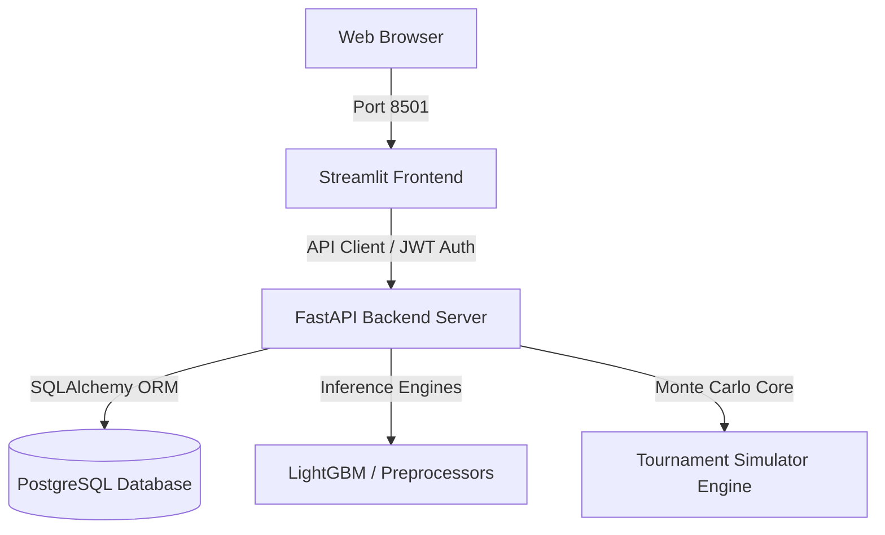

# FIFA World Cup 2026 Match Winner Prediction & Analytics Engine

A production-grade, containerized AI analytics platform to predict international football fixtures and simulate the FIFA World Cup 2026. The application leverages ELO ratings, historical results since 1872, rolling team form indexes, and a pre-trained LightGBM classifier. It separates concerns into a FastAPI backend, an interactive Streamlit dashboard, a PostgreSQL database, and Docker Compose deployment.

---

## 🏛️ System Architecture

The application is structured into isolated layers adhering to SOLID software engineering principles:



* **Frontend (Streamlit)**: Dashboard dashboard executing zero model calls directly; communicates solely with backend REST APIs via a robust API client with retry and timeout policies.
* **Backend (FastAPI)**: REST API orchestrating logins, registrations, inference computations, SHAP explainability matrices, and Monte Carlo runs.
* **Database (PostgreSQL)**: Persists user accounts, match prediction histories, simulation runs, and application performance metrics.
* **Simulation Core**: Simulates the 48-team, 12-group tournament layout with Poisson xG goal sampling and wildcard calculations.

---

## 📂 Project Directory Structure

```text
FIFA_WorldCup_Prediction/
├── backend/                   # FastAPI Backend Application
│   ├── api/routes/            # REST API Routes (predict, simulate, auth, analytics)
│   ├── config/                # Environment configurations (JWT secrets, paths)
│   ├── database/              # SQLAlchemy session and ORM schemas (Users, History, Logs)
│   ├── ml/                    # Thread-safe model loaders & SHAP service wrappers
│   ├── schemas/               # Pydantic schema validation objects
│   ├── services/              # Business logic layers (Inference, Simulation adapters)
│   └── main.py                # Server entry point
├── frontend/                  # Streamlit Frontend Dashboard
│   ├── components/            # Shared UI components
│   ├── pages/                 # Multi-page files (Match_Prediction, Team_Analytics, etc.)
│   ├── services/              # HTTP API Client client with retry/auth headers
│   └── app.py                 # Streamlit entry point
├── docker/                    # Multi-container Dockerfiles
│   ├── Dockerfile.backend
│   └── Dockerfile.frontend
├── models/                    # Serialized ML assets (best_model.pkl, scaler.pkl)
├── reports/                   # Performance figures and execution text reports
├── tests/                     # Integration tests (pytest test suite)
├── docker-compose.yml         # Container orchestration configuration
├── requirements.txt           # Unified dependency package list
└── README.md                  # Project manual (This file)
```

---

## 🚀 Deployment Guide

The entire application stack (PostgreSQL, FastAPI Backend, Streamlit Dashboard) can be launched in a single command using Docker.

### Prerequisites
* [Docker](https://docs.docker.com/get-docker/) installed.
* [Docker Compose](https://docs.docker.com/compose/install/) installed.

### 1. Build and Start Container Stack
Run the following command in the project root directory:
```bash
docker compose up --build
```
This automatically downloads PostgreSQL, compiles Python environments, mounts data volumes, registers default database structures, and starts the servers.

### 2. Verify Running Ports
* **Streamlit Dashboard**: Access [http://localhost:8501](http://localhost:8501)
* **FastAPI Docs (Swagger UI)**: Access [http://localhost:8000/docs](http://localhost:8000/docs)
* **ReDoc Documentation**: Access [http://localhost:8000/redoc](http://localhost:8000/redoc)

---

## 💻 Local Development Setup (Without Docker)

To run the application locally without Docker containers (defaults to local SQLite database):

1. **Install Dependencies**:
   ```bash
   pip install -r requirements.txt
   ```
2. **Start FastAPI Backend**:
   ```bash
   PYTHONPATH=. uvicorn backend.main:app --reload --port 8000
   ```
3. **Start Streamlit Frontend**:
   ```bash
   streamlit run frontend/app.py
   ```

---

## 📖 API Reference Documentation

### Authentication Envelopes
* `POST /api/auth/register`: Create a new user account.
* `POST /api/auth/login`: Authenticate credentials, generating a JWT bearer token.
* `GET /api/auth/profile`: Retrieve profile credentials (requires token).
* `GET /api/auth/prediction-history`: Retrieve past predictions logged by the active user (requires token).

### Match Inference API
* `POST /api/predict/`: Perform match predictions.
  * **Input Payload**:
    ```json
    {
      "home_team": "Argentina",
      "away_team": "France",
      "tournament": "FIFA World Cup",
      "venue": "neutral",
      "match_date": "2026-06-25"
    }
    ```
  * **Output Payload**: Returns winning class, W/D/L probabilities split, Poisson expected goals (xG), local SHAP value contributions, and feature importance rankings.

### Tournament Simulation API
* `POST /api/simulate/`: Triggers Monte Carlo simulations.
  * **Input Payload**: `{"run_count": 1000}` (supports 100 to 10,000 runs).
  * **Output Payload**: Returns overall champion favorites probabilities and complete 48-team multi-stage advancement progress tables.

---

## 🧪 Testing Suite

Run the integration and unit tests using `pytest`:
```bash
PYTHONPATH=. pytest tests/test_api.py
```
*(Tests mock database sessions using in-memory configurations, validating endpoints, authentication, and frontend communication layers).*
