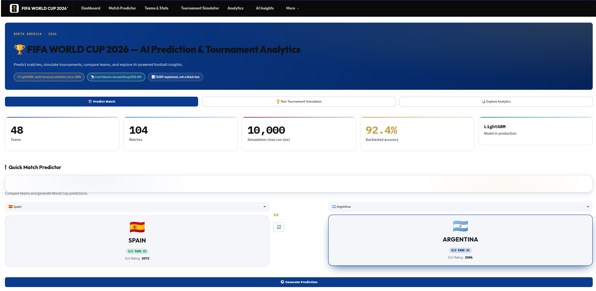
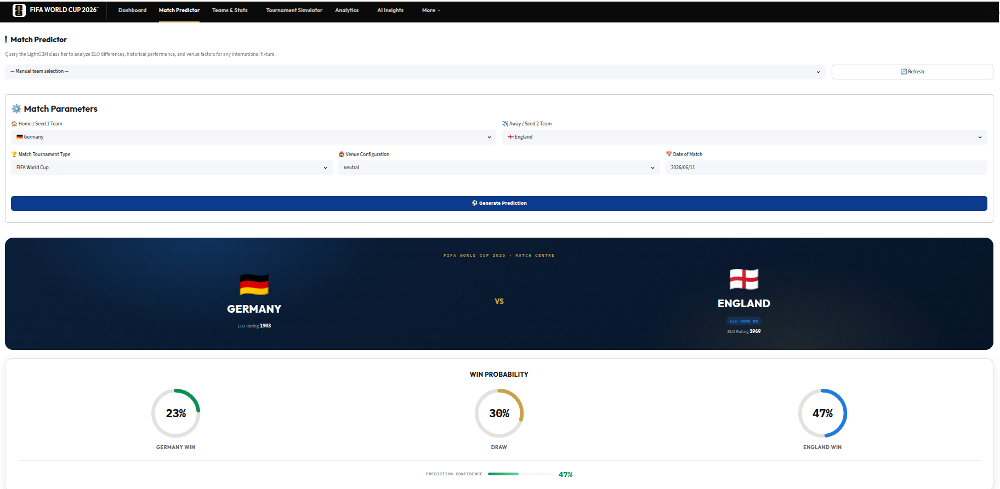
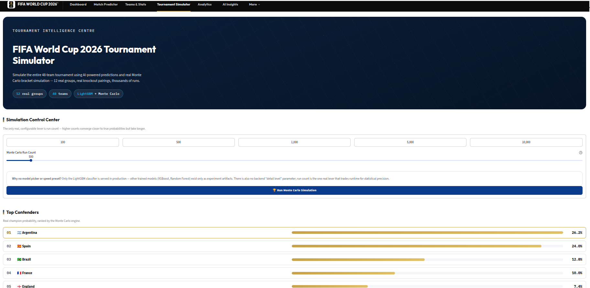
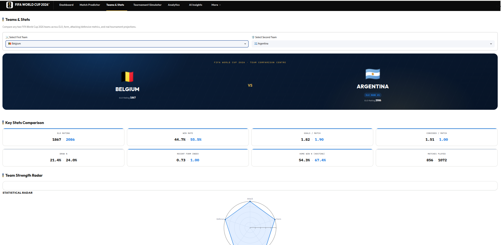
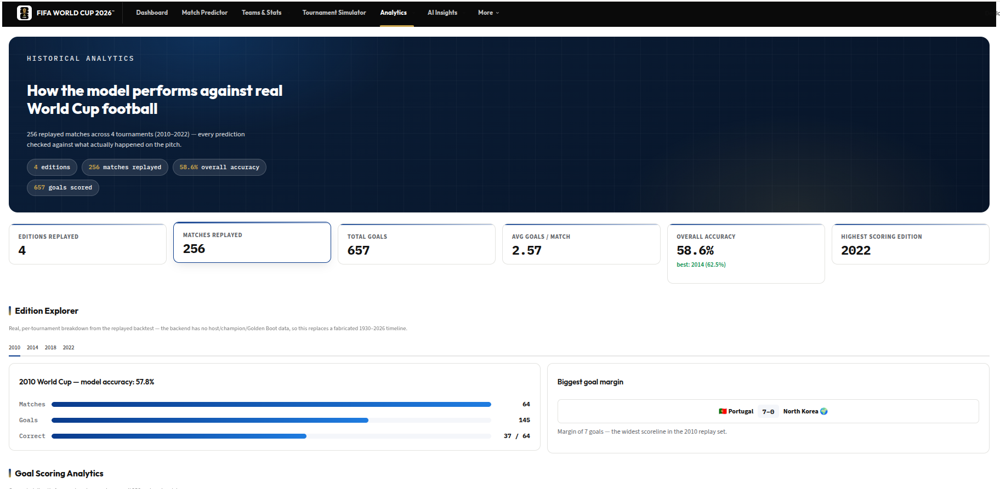
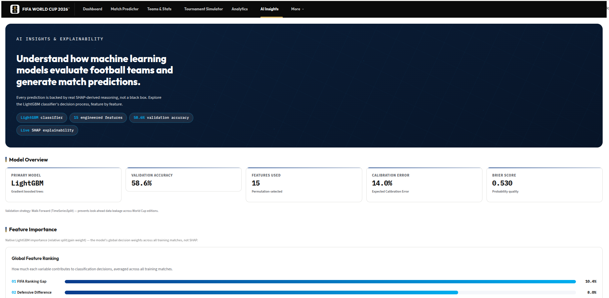

# 🏆 FIFA World Cup 2026 Prediction & Tournament Intelligence Platform

AI-powered football analytics platform for match prediction, tournament simulation, team comparison, historical analytics, and explainable AI.

Built with FastAPI, Streamlit, LightGBM, SHAP, PostgreSQL, and Monte Carlo Simulation.

---

## Dashboard Preview

<p align="center">
  
</p>

## Match Prediction

<p align="center">
  
</p>

## Tournament Simulator

<p align="center">
  
</p>

## Teams & Stats

<p align="center">
  
</p>

## Historical Analytics

<p align="center">
  
</p>

## AI Insights

<p align="center">
  
</p>

---

## 🚀 Features

### ⚽ Match Prediction
- Win / Draw / Loss probabilities
- Expected Goals (xG)
- Confidence scoring
- SHAP-based explanations

### 🎯 Tournament Simulator
- Real 48-team FIFA 2026 format
- Monte Carlo simulation
- Champion probabilities
- Most likely final
- Upset detection

### 📊 Teams & Stats
- Team comparison
- ELO rankings
- Form analysis
- Head-to-head records

### 📈 Historical Analytics
- World Cup trend analysis
- Goal scoring statistics
- Historical rankings
- Backtesting results

### 🧠 AI Insights
- SHAP explainability
- Feature importance
- Model confidence
- Prediction transparency

### 🔐 Authentication
- JWT authentication
- Prediction history
- Simulation history

---

## 🏛 Architecture

```
User
 │
 ▼
Streamlit Frontend
 │
 ▼
FastAPI Backend
 │
 ├── Prediction Service
 ├── SHAP Service
 ├── Tournament Engine
 ├── Analytics Engine
 │
 ▼
PostgreSQL
```

---

## 🛠 Tech Stack

### Backend
- FastAPI
- SQLAlchemy
- Pydantic
- JWT Authentication

### Machine Learning
- LightGBM
- Scikit-Learn
- SHAP
- Pandas
- NumPy

### Frontend
- Streamlit
- Plotly

### Infrastructure
- Docker
- Docker Compose
- PostgreSQL

---

## 📋 Dashboard Pages

| Page | Description |
|--------|--------|
| Dashboard | Home analytics hub |
| Match Predictor | AI-powered match prediction |
| Teams & Stats | Team comparison center |
| Tournament Simulator | Monte Carlo World Cup simulation |
| Historical Analytics | World Cup historical intelligence |
| AI Insights | SHAP explainability |
| Model Performance | Model evaluation metrics |
| Prediction History | User prediction records |
| Settings | Account management |

---

## 🐳 Quick Start

### Docker

```bash
docker compose up --build
```

Frontend:
http://localhost:8501

Backend:
http://localhost:8000/docs

### Local Development (no Docker)

```bash
pip install -r requirements.txt

# Terminal 1
PYTHONPATH=. uvicorn backend.main:app --reload --port 8000

# Terminal 2
streamlit run frontend/app.py
```

---

## 🔌 API Example

```
POST /api/predict/

{
  "home_team": "Argentina",
  "away_team": "France"
}
```

---

## 🤖 Machine Learning Pipeline

1. Historical Match Collection
2. Feature Engineering
3. ELO Rating Calculation
4. Model Training (LightGBM)
5. Hyperparameter Optimization
6. SHAP Explainability
7. Historical Backtesting
8. Deployment

---

## 🔮 Future Enhancements

- Live match integration
- Real-time tournament updates
- Advanced player analytics
- Computer Vision match analysis
- LLM-powered football assistant
- Reinforcement learning tournament strategies

---

## 👨‍💻 Author

**Farhan Shahid**

Master's Student in Robotics & AI

Interests:
- Machine Learning
- Computer Vision
- SLAM
- Sports Analytics
- Robotics

GitHub: [http://github.com/Farhan3376](http://github.com/Farhan3376)

LinkedIn: [www.linkedin.com/in/farhan-shahid-robotics](http://www.linkedin.com/in/farhan-shahid-robotics)
# FIFA-WORLD-CUP-2026-PREDICTION
