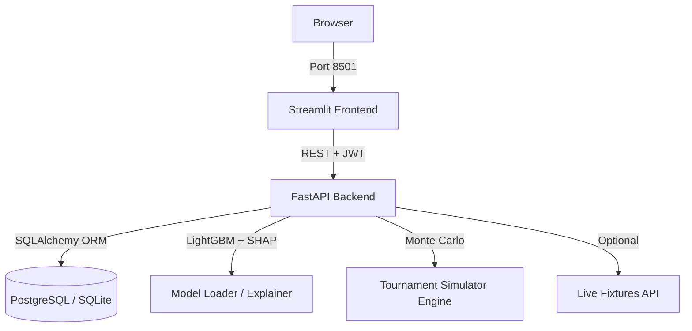

# FIFA World Cup 2026 Prediction & Tournament Intelligence Platform


An end-to-end AI analytics platform that predicts international football match outcomes and simulates the entire FIFA World Cup 2026. It combines a LightGBM classifier trained on ELO ratings and rolling team form with a real Monte Carlo tournament engine (12 groups, 48 teams, full knockout bracket simulation), and exposes both through a FastAPI backend and a multi-page Streamlit dashboard with SHAP-based explainability throughout.

---

## Highlights

- **Match prediction** — win/draw/loss probabilities and expected goals (xG) for any of the 48 qualified 2026 teams, with a live SHAP explanation of *why* the model favors one side.
- **Tournament simulation** — a real 12-group, 48-team bracket engine (`simulation/`) runs Poisson-sampled group and knockout matches; running it thousands of times (Monte Carlo) yields champion odds, per-team stage-advancement probabilities, the most common real final matchup, a sample bracket path, and an ELO-rank-vs-simulated-odds upset detector.
- **Explainable AI** — global LightGBM feature importances and true per-match SHAP contributions (base value + signed feature impacts), not just static charts.
- **Historical backtesting** — the model replayed against 256 real World Cup matches across four editions (2010, 2014, 2018, 2022), with full calibration diagnostics (Brier score, expected calibration error, reliability bins).
- **Live fixtures** — optional integration with a public World Cup 2026 fixtures API for real qualified-team lists and live score-adjusted predictions.
- **Auth & history** — JWT-based accounts with persisted prediction and simulation history.

---

## Architecture



- **Frontend (Streamlit)** — never calls the model directly; every page talks to the backend through a single API client (`frontend/services/api_client.py`) with retry/timeout handling.
- **Backend (FastAPI)** — orchestrates auth, inference, SHAP explanations, and Monte Carlo simulation runs; all business logic lives in `backend/services/`.
- **Simulation core (`simulation/`)** — a genuine bracket engine: real group draws (`bracket_generator.py`), Poisson-sampled match outcomes (`tournament_simulator.py`), and repeated-run aggregation with finalist-pair tracking (`monte_carlo.py`).
- **Database** — PostgreSQL in Docker, or a local SQLite fallback for development; stores user accounts, prediction history, and simulation history.

---

## Project Structure

```text
FIFA_WorldCup_Prediction/
├── backend/
│   ├── api/routes/         # analytics, authentication, live, prediction, simulation
│   ├── config/             # Settings (env-driven, JWT, DB, model paths)
│   ├── database/           # SQLAlchemy models and session management
│   ├── ml/                 # Thread-safe model loader + SHAP explainer service
│   ├── schemas/             # Pydantic request/response schemas
│   ├── services/           # Business logic (prediction, simulation, analytics, live fixtures)
│   └── main.py              # FastAPI app entry point
├── frontend/
│   ├── pages/               # Dashboard, Match Predictor, Teams & Stats, Tournament
│   │                         # Simulator, Team Analytics, Historical Analytics,
│   │                         # Model Performance, AI Insights, Prediction History, Settings
│   ├── services/            # api_client.py, theme.py (shared design system), team_data.py
│   └── app.py                # Streamlit entry point, navigation, page registration
├── simulation/                # Bracket generator, match predictor, Monte Carlo engine
├── src/                       # Data pipeline: collection, feature engineering, training
├── models/                    # best_model.pkl + preprocessing artifacts (tracked);
│                               # other experiment models are gitignored
├── reports/                   # EDA figures, model comparison reports, calibration metrics
├── outputs/                   # Simulation/prediction output snapshots
├── docker/                    # Dockerfile.backend, Dockerfile.frontend
├── docker-compose.yml
├── requirements.txt
└── tests/                     # pytest integration tests
```

---

## Getting Started

### Option A — Docker (recommended)

```bash
docker compose up --build
```

This starts PostgreSQL, the FastAPI backend, and the Streamlit frontend together.

Set a real `JWT_SECRET_KEY` in your environment (or an `.env` file referenced by `docker-compose.yml`) before running in production — the compose file will refuse to start without one:

```bash
export JWT_SECRET_KEY=$(python3 -c "import secrets; print(secrets.token_hex(32))")
docker compose up --build
```

Once running:

| Service | URL |
|---|---|
| Streamlit dashboard | http://localhost:8501 |
| FastAPI Swagger docs | http://localhost:8000/docs |
| FastAPI ReDoc | http://localhost:8000/redoc |

### Option B — Local development (no Docker)

Falls back to a local SQLite database automatically when `DB_HOST` isn't set.

```bash
pip install -r requirements.txt

# Terminal 1
PYTHONPATH=. uvicorn backend.main:app --reload --port 8000

# Terminal 2
streamlit run frontend/app.py
```

---

## Dashboard Pages

| Page | What it does |
|---|---|
| Dashboard | Quick match predictor, top contenders, recent predictions, AI insight preview |
| Match Predictor | Full win-probability breakdown, team comparison radar, SHAP-driven explanation |
| Teams & Stats | Head-to-head team comparison, form index, tournament-strength projections |
| Tournament Simulator | Configurable Monte Carlo run count, real sample bracket, most-likely final, stage-probability matrix, upset detector |
| Team Analytics | National team profile, ELO rank, rolling stats |
| Historical Analytics | Real 256-match backtest across four World Cup editions, goal analytics, head-to-head, calibration diagnostics |
| AI Insights & Explainability | Global feature importance, live per-match SHAP contribution bars, prediction confidence, model trust/transparency |
| Model Performance | Training hyperparameters, calibration reliability diagram, feature sensitivity |
| Prediction History | Past predictions logged by the signed-in user |
| Settings | Account and application settings |

---

## API Reference

Interactive documentation is always available at `/docs` (Swagger) and `/redoc` while the backend is running. Key endpoints:

### Authentication
| Method | Endpoint | Description |
|---|---|---|
| POST | `/api/auth/register` | Create a user account |
| POST | `/api/auth/login` | Authenticate, returns a JWT bearer token |
| GET | `/api/auth/profile` | Get the authenticated user's profile |
| GET | `/api/auth/prediction-history` | Get the authenticated user's past predictions |

### Prediction
| Method | Endpoint | Description |
|---|---|---|
| POST | `/api/predict/` | Predict a single match outcome |

```json
{
  "home_team": "Argentina",
  "away_team": "France",
  "tournament": "FIFA World Cup",
  "venue": "neutral",
  "match_date": "2026-06-25"
}
```

Returns `predicted_winner`, `probabilities` (home/draw/away), `confidence_score`, `expected_goals`, global `feature_importance`, and a full `shap_explanation` (`base_value`, signed per-feature `contributions`, `total_impact`).

### Tournament Simulation
| Method | Endpoint | Description |
|---|---|---|
| POST | `/api/simulate/` | Run a Monte Carlo tournament simulation |

```json
{ "run_count": 1000 }
```

Returns `champion_odds`, per-team `stage_probabilities` (group stage through champion), `most_likely_final` (the real most-common finalist pairing), `upsets` (teams whose simulated rank meaningfully beats their ELO rank), and `sample_bracket` (one real simulated knockout path, Round of 32 through Final).

### Analytics
| Method | Endpoint | Description |
|---|---|---|
| GET | `/api/analytics/teams` | List all recognized teams (historical ELO database) |
| GET | `/api/analytics/team/{team_name}` | ELO rating and rolling stats for one team |
| GET | `/api/analytics/global` | Global ELO rankings and goal distributions |
| GET | `/api/analytics/historical` | Historical backtest replay, accuracy metrics, classification report |
| GET | `/api/analytics/feature-importance` | Global LightGBM feature importances |
| GET | `/api/analytics/model-performance` | Training config, calibration, sensitivity metrics |

### Live Fixtures (optional, third-party data)
| Method | Endpoint | Description |
|---|---|---|
| GET | `/api/live/teams` | The real 48 FIFA World Cup 2026 qualified teams |
| GET | `/api/live/fixtures` | Scheduled fixtures |
| GET | `/api/live/fixtures/live` | Fixtures currently in progress |
| GET | `/api/live/predict/{home_team}/{away_team}` | Prediction adjusted for a live in-progress score |

---

## Machine Learning Pipeline

The full training pipeline lives under `src/` and `run_pipeline.py`:

1. **Data collection** (`src/phase1/`) — historical international results since 1872, merged and validated.
2. **Feature engineering** (`src/phase2/`) — ELO ratings, rolling form, goal differentials, home/away splits.
3. **Model selection** (`src/model_selection.py`, `src/hyperparameter_tuning.py`) — LightGBM, XGBoost, Random Forest, and others compared; LightGBM was selected and is the only model served in production (`models/trained/best_model.pkl`).
4. **Explainability** (`src/explainability.py`, `backend/ml/shap_explainer.py`) — SHAP `TreeExplainer` computes real per-prediction feature contributions, served live via `/api/predict/`.
5. **Evaluation** (`src/evaluate.py`, `evaluation/`) — historical replay backtesting, calibration analysis, sensitivity analysis.

> Only `best_model.pkl` and its preprocessing artifacts (scaler, imputer, feature selector) are tracked in this repository. Other experiment-stage models (XGBoost, Random Forest, CatBoost, etc.) were part of model selection but are not served and are excluded via `.gitignore` to keep the repository lightweight.

---

## Testing

```bash
PYTHONPATH=. pytest tests/test_api.py
```

Tests use an in-memory database session and cover authentication, prediction, and simulation endpoints.

---

## Configuration

All runtime settings are environment-driven (`backend/config/config.py`), with sensible local-development defaults:

| Variable | Purpose | Default (dev) |
|---|---|---|
| `ENV` | `development` or `production` | `development` |
| `DATABASE_URL` | Full database connection string | SQLite fallback |
| `DB_HOST`, `DB_USER`, `DB_PASSWORD`, `DB_NAME` | PostgreSQL connection (used when `DATABASE_URL` isn't set) | — |
| `JWT_SECRET_KEY` | JWT signing secret | Randomly generated per process in dev; **must** be set explicitly in production |

---

## Tech Stack

**Backend:** FastAPI, SQLAlchemy, Pydantic, python-jose, passlib
**ML:** LightGBM, scikit-learn, SHAP, pandas, NumPy
**Frontend:** Streamlit, Plotly
**Infra:** Docker, Docker Compose, PostgreSQL
